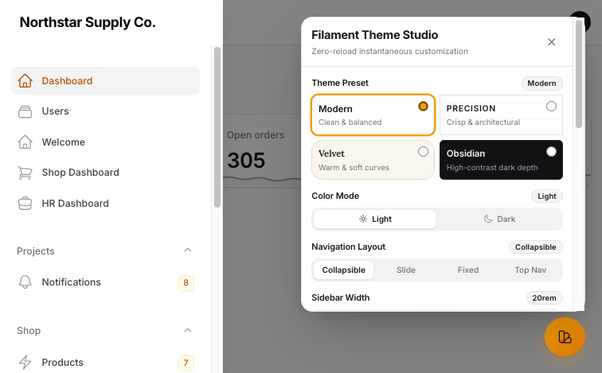
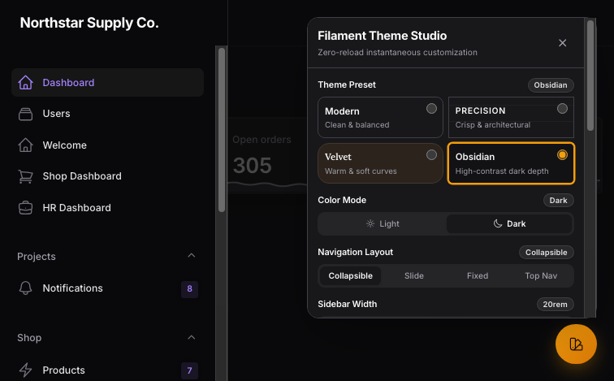
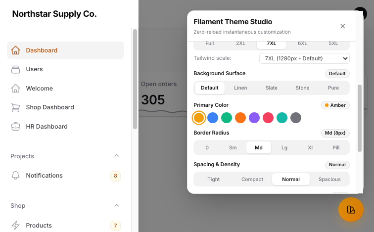
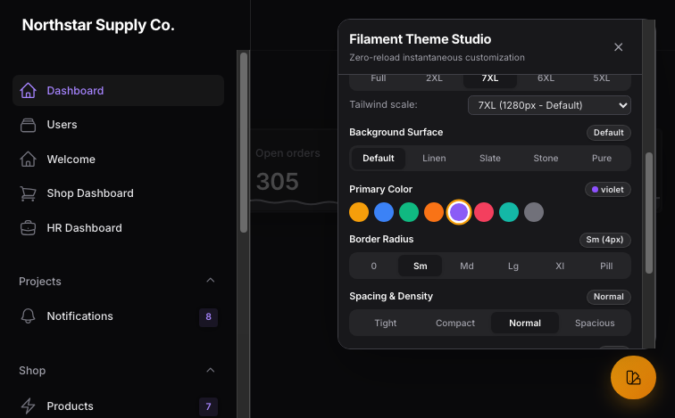
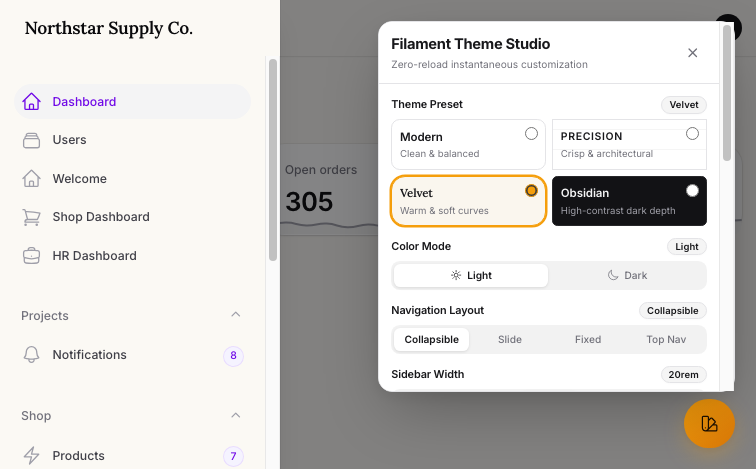
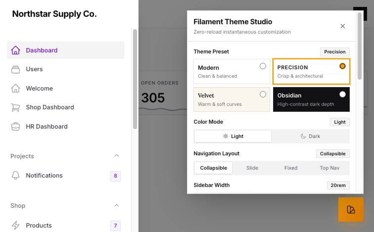

# 🎨 Filament Theme Customizer (Theme Studio)

<p align="center">
  <a href="https://packagist.org/packages/cuongpham2107/filament-theme-customizer">
    
  </a>
  <a href="https://packagist.org/packages/cuongpham2107/filament-theme-customizer">
    
  </a>
  <a href="LICENSE.md">
    
  </a>
  <a href="https://filamentphp.com">
    
  </a>
</p>

A powerful, elegant, **zero-reload** visual Theme Studio plugin for **Filament v5**. Empowers users and administrators to customize their panel experience in real time with instantaneous live preview, zero flash of unstyled theme (Anti-FOUC), and granular authorization controls.

---

<p align="center">
  
</p>

<p align="center">
  
</p>

---

## 🖼️ Visual Showcase

| Light Mode (Palettes, Radius & Density) | Obsidian Dark Mode (Violet & Deep Blacks) |
|:---:|:---:|
|  |  |

| Velvet Theme (Warm & Soft Curves) | Precision Theme (Crisp Architectural Borders) |
|:---:|:---:|
|  |  |

---

## ✨ Features

- ⚡ **Zero-Reload Instant Preview**: Hot-swaps themes, styles, colors, layouts, and typography in real time with zero page refresh.
- 🎨 **Official Theme Presets**: **Modern**, **Precision**, **Velvet**, and **Obsidian** (matching official Filament styling).
- 🌓 **Instant Dark / Light Mode**: Seamless transitions with full Tailwind dark mode compatibility.
- 🌈 **8 Curated Color Palettes**: Amber, Blue, Forest, Violet, Rose, Teal, Zinc, and Citrus with auto-contrasted primary button text.
- 🔲 **Live Corner Radius**: None (`0px`), Small (`4px`), Medium (`8px`), Large (`12px`), and Pill (`9999px`).
- 📐 **Live Spacing & Density**: Tight, Compact, Normal, and Spacious.
- 🔤 **Live Typography**: Inter, Outfit, Plus Jakarta Sans, Figtree, Lora, and JetBrains Mono.
- 📏 **Filament-Style Font Size Slider**: Sleek compact slider with discrete stops (`XS`, `SM`, `MD`, `LG`, `XL`) and signature handle.
- 🧭 **Navigation Layouts**:
  - Collapsible Sidebar
  - Fully Collapsible (Slide-over overlay with topbar toggle)
  - Fixed Sidebar
  - Top Navigation (Full-width topbar navbar)
- 💾 **Database Persistence (User Preferences)**: Saves each user's customized theme to the database (`filament_theme_settings`), seamlessly syncing across their laptops, workstations, and mobile devices.
- 👑 **Super Admin Global Default**: Super admins can set the active theme as the **System Default** for all guest pages and new users with a single click.
- ↺ **One-Click Reset to System Default**: Users can instantly revert their custom theme back to the organization's official brand standard.
- 🔒 **Granular Authorization**: Dual-layer permission controls via `canCustomize()` and `canSetGlobalDefault()` with `Closure` callbacks and dependency injection.
- 🛡️ **Zero-FOUC Engine**: Ultra-fast server-side inline hydration in `<head>` (< 0.1ms via Cache) preventing layout shift and white flicker.

---

## 📦 Installation

Install the package via Composer:

```bash
composer require cuongpham2107/filament-theme-customizer
php artisan migrate
```

---

## 🚀 Quick Start

### 1. Register in your Filament Panel Provider

Add `ThemeCustomizerPlugin::make()` to your panel configuration (e.g. `app/Providers/Filament/AdminPanelProvider.php`):

```php
use CuongPham\FilamentThemeCustomizer\ThemeCustomizerPlugin;

public function panel(Panel $panel): Panel
{
    return $panel
        // ...
        ->plugin(
            ThemeCustomizerPlugin::make()
                // Optional: button position ('bottom-right' or 'bottom-left', default: 'bottom-right')
                ->position('bottom-right')
                
                // 1. Permission to customize and save personal preferences to DB
                ->canCustomize(fn (): bool => auth()->check())
                
                // 2. Permission for Super Admin to set the System-Wide Global Default
                ->canSetGlobalDefault(fn (): bool => auth()->user()?->hasRole('super_admin') ?? false)
        );
}
```

### 2. Configure Tailwind Theme CSS

In your panel's theme stylesheet (e.g. `resources/css/filament/admin/theme.css`), import the plugin stylesheet and register the view files in your `@source` directive:

```css
@import '../../../../vendor/filament/filament/resources/css/theme.css';
@import '../../../../vendor/cuongpham2107/filament-theme-customizer/resources/css/theme-customizer.css';

@source '../../../../app/Filament/**/*';
@source '../../../../resources/views/filament/**/*';
@source '../../../../vendor/cuongpham2107/filament-theme-customizer/resources/views/**/*.blade.php';
```

Then rebuild your assets:

```bash
npm run build
```

---

## ⚙️ Configuration & Authorization

### Dynamic Permission Control

The `canCustomize()` method accepts either a boolean or a `Closure`:

```php
// Grant access only to Super Admins
ThemeCustomizerPlugin::make()
    ->canCustomize(fn (): bool => auth()->user()?->can('manage_theme') ?? false)

// Only enable in local development
ThemeCustomizerPlugin::make()
    ->canCustomize(app()->isLocal())

// Dependency injection in closure
ThemeCustomizerPlugin::make()
    ->canCustomize(function (?\App\Models\User $user): bool {
        return $user && $user->is_admin;
    })
```

---

## 🎨 Publishing Views (Optional)

If you want to customize the Blade templates:

```bash
php artisan vendor:publish --tag=filament-theme-customizer-views
```

The views will be published to `resources/views/vendor/filament-theme-customizer`.

---

## 📄 License

The MIT License (MIT). Please see [License File](LICENSE.md) for more information.
